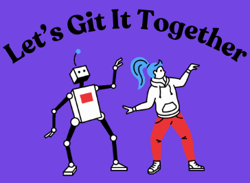
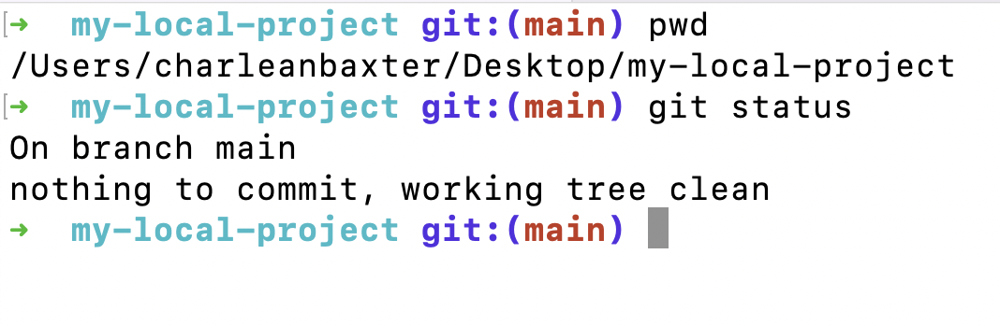
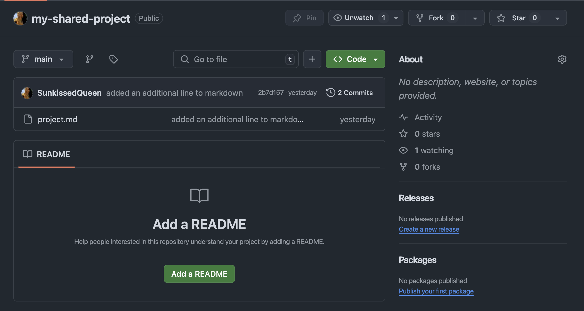

# Let's Git It Together: Introduction to Version Control and Collaborative Coding



## Introduction

Let's take a moment to reflect on how far technology has come. Just think about it---people used punch cards to interact with computers! Today, we have powerful tools at our fingertips that allow us to collaborate seamlessly. However, these advancements come challenges, especially when multiple people are working on the same project.

Git is a version control system that tracks changes in files and allows multiple people to work on a project without overwriting each other's work. GitHub is a platform that hosts Git repositories online, making it easier for teams to collaborate.

---

## Hands-On Activity: Setting Up a Local Git Repository



1. **Open Terminal**:  
    - First, open your terminal application.

2. **Check Current Directory**:  
    - Type `pwd` and press Enter. This command shows your current working directory.

3. **Create a New Directory**:  
    - Now let's create a new directory for our project. Type `mkdir my-local-project` and then navigate into it with `cd my-local-project`.

4. **Initialize a New Git Repository**:  
    - Next, we'll initialize our Git repository by typing `git init`. This command sets up a new Git repository in our project folder.

5. **Establish a Main Branch**:  
    - Best practice---rename default branch from "master" to "main" by typing `git branch -M main`.

6. **Create a Markdown File**:  
    - Let's create a new Markdown file by typing `touch project.md`.

7. **Add Content to the Markdown File**:  
    - Open `project.md` in your favorite text editor and add some initial content, like this:
    ```markdown
      # My Local Project

      This is a Markdown file that helps me create formatted documents, such as README files, to explain my project's features.
    ```

8. **Check Git Status**:  
    - Now let's check the status of our repository by typing `git status`. This will show us any untracked files.

9. **Stage the Changes**:  
    - Type `git add project.md` to stage your changes for commit.

10. **Commit Changes**:  
    - Now let's commit those changes with `git commit -m 'Initial commit: Add project.md'`. This saves our current state in the repository.

11. **Creating Feature Branches**:  
    - Let's create a new branch for adding more content by typing `git checkout -b feature`. 
  
12. **Add More Content to the Markdown File**:
    - Open project.md again and add another section:  
    ```md
      ## Additional Content

      This section includes more details about my project.
    ```

13. **Stage and Commit Again**:  
    - Stage your changes with `git add project.md`.  
    - Commit them with `git commit -m "Add additional content to project.md"`.

14. **Merge Changes Back to Main Branch**:  
    - Switch back to the main branch using `git checkout main`.  
    - Merge your feature branch with `git merge feature`.

15. **Final Check of Git Status**:  
    - After merging, type `git status`.
    - This final check ensures everything is merged correctly, and there are no uncommitted changes. The main branch now contains the updated project with additional content.

16. **Deleting Stale Branches**:  
    - To see all local branches, type: `git branch`.  
    - If you have finished working on your feature branch and want to delete it, type: `git branch -d feature`.

17. **Display the commit history**:  
    - To see a list of all commits that track changes over time of your project, type: `git log`

---

## Hands-On Activity: Linking/Tracking Local Project on GitHub



### Step 1:Create an Empty Repository on GitHub

1. **Log in to GitHub**:
    - Open your web browser and go to [GitHub.com](https://github.com).
    - Sign in with your GitHub account.

2. **Create a New Repository**:
    - Click **New repository** button.

3. **Fill Out Repository Details**:
    - **Repository Name**: Enter a name for your repository (e.g., `my-shared-project`).
    - **Visibility**: Choose  **Public**.
    - Select **Add a README file**.

4. **Create the Repository**:
    - Click the green **Create repository** button at the bottom of the page.

### Step 2: Link Your Main Branch from the Local Repository to GitHub

1. **Open Your Terminal or Command Prompt**:
    - For Mac, open the Terminal from Applications > Utilities.
    - For Windows, open Command Prompt or Git Bash.

2. **Navigate to Your Project Directory**:
    - Use the `cd` command to change to the directory where you want your local repository: `cd path/to/your/project`

3. **Add a Remote Origin**:
    - Link your local repository to the empty GitHub repository. You can find the remote origin on your repository page under "…or push an existing repository from the command line". The command should look similar to the following: `git remote add origin <repository-url>`

4. **Verify the Remote Link**:
    - To ensure that your local repository is linked correctly, you can check the remote settings by typing: `git remote -v`

5. **Push Local Main Branch to GitHub**:
    - Push your local branch to the GitHub repository by typing: `git push origin main`

6. **Verify Local Repo Linked to GitHub**:
    - Go back to your GitHub repository page. Refresh screen. Verify that all files are located in the GitHub repo and that the branch name is "main".

### Step 3: Navigating GitHub Graphical User Interface (GUI) After Pushing a Feature Branch

1. **Creating Pull Requests**:
    - If you’ve worked on a feature branch, perform the git workflow locally  
      a. `git status`  
      b. `git add <file-name>`  
      c. `git commit -m "brief message of the purpose of the changes"`  
      d. `git push origin <branch-name>`  
    - Go back to your GitHub repository page.  
    - Click on the **Pull requests** tab and then click on **New pull request**.
    - Select the branch you want to merge into main and click on **Create pull request**.  
    - Add comments about what changes were made and click on **Create pull request** again.

2. **Merging Pull Requests**:  
    - A pull request is the process of submitting local code contributions to a remote project.  
    - Once you push a feature branch to GitHub, you will see a **Compare & pull request** message on your GitHub GUI. Click the **Compare & pull request**button.  
    - This will redirect you to a page where we can create a pull request. Create a descriptive message on the text field or in the comment section.  
    - Click the **Create pull request** button.
    - If there are not any requested changes or error messages, then click the **Merge pull request** button.

3. **Deleting Stale Branch on GitHub**:  
    - The main branch has been updated with the changes from the feature branch. The pull request has been successfully merged and closed.  
    - Click the **Delete branch** button.

4. **Deleting Stale Branches on Local Machine**:
    - These actions will update your local repository with the latest changes from the remote repository as well as delete stale branches locally. 
    a. `git checkout main`  
    b. `git pull origin main`  
    c. `git branch -d <branch-name>`  
    
---

### Hands-On Activity: Cloning a GitHub Repo

1. **Log in to GitHub**:
    - Open your web browser and go to [GitHub.com](https://github.com).
    - Sign in with your GitHub account.

2. **Create a New Repository**:
    - Click **New repository** button.

3. **Fill Out Repository Details**:
    - **Repository Name**: Enter a name for your repository (e.g., `my-shared-project`).
    - **Visibility**: Choose  **Public**.
    - Leave the other options unchecked since we want the repository to be empty.

4. **Create the Repository**:
    - Click the green **Create repository** button at the bottom of the page.

5. **Cloning the Repository**:  
    - To work on your project locally, you'll need to clone the repository. Cloning a repository is copying the directory from GitHub and making it available on our local.  
    - Click the **Repositories** link from GitHub
    - Click the repository you want to save locally.
    - Click the green **Code** button.  
    - Copy the HTTPS url.  
    - Open your terminal or command prompt and type `git clone <repository-url>`, replacing `<repository-url>` with the URL you just copied.

6. **Verify Remote Repo Cloned Locally**:  
    - Navigate to the cloned repo by typing `cd <repo-name>`.
    - List the contents of the local directory by typing `ls`.

---

### Creating the Mad Libs Game with AI tools

1. **Setting Up Your Project**:
    - In your cloned repository folder, create an HTML file by typing `touch index.html` in your terminal. Create an CSS file by typing `touch style.css` in your terminal. Create an JS file by typing `touch script.js` in your terminal.
   
2. **Create HTML, CSS, JS Structure using AI**:
    - Open your web browser and go to [Perplexity.ai](https://www.perplexity.ai/). 
    - Prompting the AI: When using an AI tool, the way you phrase your prompt is crucial. Consider including keywords that reflect the tone or style you want. For example, if you want the AI to generate a funny story template for a potluck-themed Mad Libs game, you might prompt it with something like:  

    "Create a funny madlib template for a potluck where someone accidentally brings candy instead of their favorite dish? The project should be created using html, css, and js."  

    - Reviewing AI-Generated Content: Once the AI generates content, it's essential to review it carefully before using it in your project. It might include errors or suggestions that don’t fit your vision. Ensure that the content aligns with your project goals and maintains a consistent style. Be mindful of originality and avoid directly copying content without understanding its context.

3. **Integrating into Our Game**:  
    - Once we have a solid story template from the AI that fits our needs, we can integrate it into our Mad Libs game code."

    - Open `index.html` in your text editor and add the following code:
    ```html
    <!DOCTYPE html>
    <html lang="en">
      <head>
        <meta charset="UTF-8">
        <meta name="viewport" content="width=device-width, initial-scale=1.0">
        <title>Mad Libs Game</title>
      </head>
      <body>
        <h1>Funny Potluck Mad Libs Game</h1>
        <div class="input-container">
            <label for="name">Your Name:</label>
            <input type="text" id="name">
        </div>
        <div class="input-container">
            <label for="dish">Favorite Dish:</label>
            <input type="text" id="dish">
        </div>
        <div class="input-container">
            <label for="snack">Favorite Snack:</label>
            <input type="text" id="snack">
        </div>
        <div class="input-container">
            <label for="collection">Collection of Objects:</label>
            <input type="text" id="collection">
        </div>
        <button onclick="generateMadLib()">Create Mad Lib!</button>
        <div class="result" id="result"></div>
      </body>
    </html>
    ```
    - Open `style.css` in your text editor and add the following code:     
    ```css
      body {
          font-family: Arial, sans-serif;
          background-color: #f4f4f4;
          padding: 20px;
      }
      h1 {
          color: #333;
      }
      .input-container {
          margin-bottom: 10px;
      }
      button {
          padding: 10px 15px;
          background-color: #28a745;
          color: white;
          border: none;
          cursor: pointer;
      }
      button:hover {
          background-color: #218838;
      }
      .result {
          margin-top: 20px;
          font-size: 1.2em;
          color: #555;
      }
    ```
    - Open `script.js` in your text editor and add the following code:     
    ```js
      function generateMadLib() {
        const name = document.getElementById('name').value;
        const dish = document.getElementById('dish').value;

        const story = `At the potluck, ${name} was super excited to share their favorite dish, ${dish}. However, when it was time to eat, they realized they had accidentally brought a giant bowl of ${snack} instead! In a panic, ${name} tried to swap their ${snack} for someone else's delicious lasagna but ended up with a container of ${collection} instead. Everyone burst out laughing as they thought this was a prank meal. ${name} became the life of the party for bringing the most unexpected dish ever!`;

        document.getElementById('result').innerText = story;
      }
    ```

4. **Running Your Game**:
    - Perform git and GitHub workflow to save your changes and open `index.html` in your web browser to test out your game!

---

#### Git Hygiene

1. **Check Your Location**:
    - Verify you are in the correct directory before making changes. This reduces unwanted changes to projects.

2. **Commit Often**:
    - Make small commits frequently rather than large ones infrequently. This helps keep track of changes easily.

3. **Use Meaningful Commit Messages**:
    - Write clear commit messages that describe what changes were made. A good rule of thumb is to keep it under 50 characters for the summary.

4. **Use Branches Effectively**:
    - Always create new branches for features or fixes instead of committing directly to main. This keeps your main branch stable.

5. **Make Changes to the Latest**:
    - Always pull from the remote repository before making changes to ensure you are working with the latest code.

6. **Delete Merged Branches**:
    - After merging a feature branch into main, delete it to keep your branch list clean.

---
